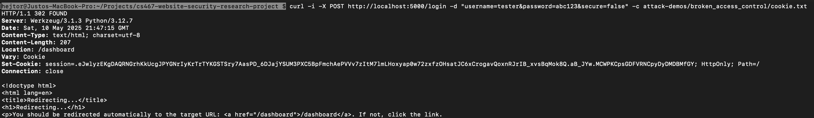
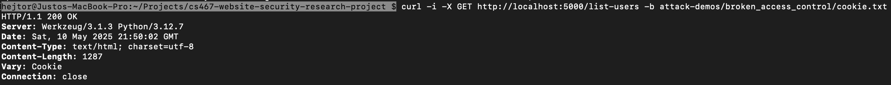
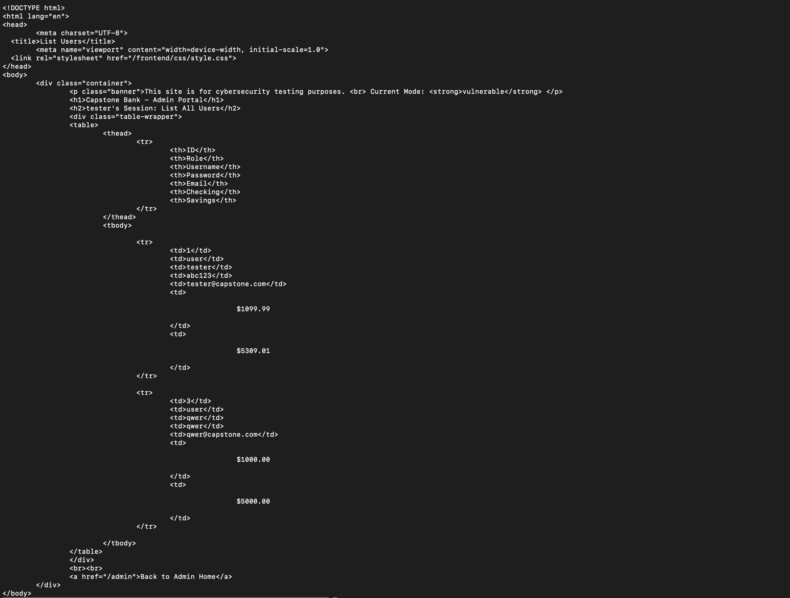
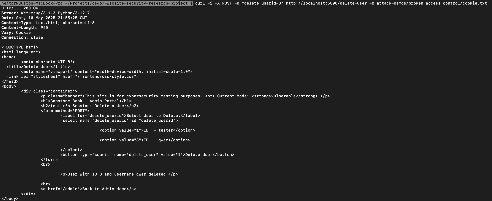
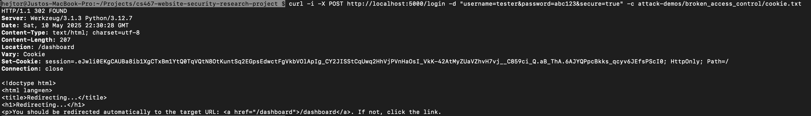
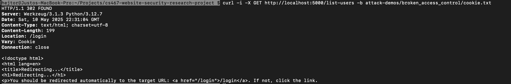
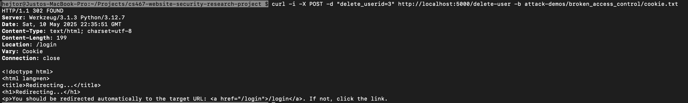

# Broken Access Control

## Testing
The following is a demonstration on how a malicious user with non-admin credentials could conduct 
a Broken Access Control attack on the app to **delete** another user's account.

### App in vulnerable mode
The followin curl command will log in the user with credentials username: "tester" and password: "abc123".
The flag -i shows the HTTP response headers, -X specifies the request method, -d defines the data sent in the body, 
and -c saves the cookie in the specified filepath/filename.
Also, to set the app in vulnerable mode, the field secure: "false" was included. 

curl -i -X POST http://localhost:5000/login -d "username=tester&password=abc123&secure=false" -c attack-demos/broken_access_control/cookie.txt

Once the user is logged in, the session cookie will be saved as 'cookie.txt'
in the pre-existing directory attack-demos/broken_access_control:

The app responds with a 302, which indicates a redirection of the user (soon-to-be-attacker) to /dashboard, 
typical destination of non-admin users, as shown in the user's terminal's response to the curl command:

Once logged in and getting hold of the session cookie, the attacker will use the cookie to perform the 
actual Broken Access Control. This kind of Broken Access Control attack is named **'Vertical'** 
because a non-admin user (attacker) access administrator-level functionalities using the cookie. 
In the example below, the attacker wants to know user IDs so it can delete user accounts.
The following curl command gets the list of users (by username and ID) 
by retrieving and sending the session cookie for authentication:

curl -i -X GET http://localhost:5000/list-users -b attack-demos/broken_access_control/cookie.txt

The app responds with a 200, and the attacker receives the list of users by name and ID in the terminal's response:

Finally, the attacker uses one of the IDs from the above list to issue another curl command 
deleting the user with ID=3 (and also using the same session cookie for authentication):  

curl -i -X POST -d "delete_userid=3" http://localhost:5000/delete-user -b attack-demos/broken_access_control/cookie.txt

The app responds with a 200, which means that the attacker succeeded in deleting a user:

### App in secure mode
The followin curl command will log in the user with credentials username: "tester" and password: "abc123".
Also, to set the app in secure mode, the field secure: "true" was included. 

curl -i -X POST http://localhost:5000/login -d "username=tester&password=abc123&secure=true" -c attack-demos/broken_access_control/cookie.txt

Once the user is logged in, the session cookie will be saved as 'cookie.txt'
in the pre-existing directory attack-demos/broken_access_control:

The app responds with a 302, which indicates a redirection of the user (soon-to-be-attacker) to /dashboard, 
typical destination of non-admin users, as shown in the user's terminal's response to the curl command:

Once logged in and getting hold of the session cookie, the attacker will try to use the cookie to perform the 
actual Broken Access Control. In the example below, the attacker wants to know user IDs so it can delete user accounts.
The following curl command gets the list of users (by username and ID) 
by retrieving and sending the session cookie for authentication:

curl -i -X GET http://localhost:5000/list-users -b attack-demos/broken_access_control/cookie.txt

But the app responds with a 302 after checking that the attacker's role is not 'admin', thus intercepting the attack 
and redirecting the attacker to the login endpoint:

Even if the attacker knows a user ID and wants to delete the user with ID=3 
(also using the same session cookie for authentication), and uses the curl command:

curl -i -X POST -d "delete_userid=3" http://localhost:5000/delete-user -b attack-demos/broken_access_control/cookie.txt

The app responds with a 302 after checking that the attacker's role is not 'admin', thus intercepting the attack 
and redirecting the attacker to the login endpoint:

