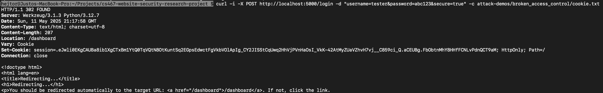

# Broken Access Control

## Testing Vertical Broken Access Control
A Broken Access Control attack can be **'Vertical'** when "a user can gain access to functionality that they are not 
permitted to access." (PortSwigger, n.d.) The following is a demonstration on how a malicious user with non-admin 
credentials could conduct a Vertical Broken Access Control attack on the app to **delete** another user's account. 
This deletion is, of course, an admin-exclusive privilege. 

In this section, the app's endpoints **/list-users** and **/delete-user** will be tested for Broken Access Control in 
its Vertical Privilege Escalation variant.

### App in vulnerable mode
The following curl command will log in the user with credentials *username*="tester" and *password*="abc123". The flag 
-i shows the HTTP response headers, -X specifies the request method, -d defines the data sent in the body, and -c saves 
the cookie in the specified filepath/filename. (curl, n.d.) Also, to set the app in vulnerable mode, the field 
*secure*="false" was included. 

`curl -i -X POST http://localhost:5000/login -d "username=tester&password=abc123&secure=false" -c attack-demos/broken_access_control/cookie.txt`

Once the user is logged in, the session cookie will be saved as 'cookie.txt' in the pre-existing directory 
attack-demos/broken_access_control. The app responds with a 302 (Found) status, redirecting the user 
(soon-to-be-attacker) to /dashboard, the default destination for non-admin users, as shown in the user's terminal's 
response to the curl command: 

Once logged in and getting hold of the session cookie, the attacker will use the cookie to perform the Broken Access 
Control attack through vertical privilege escalation. In the present example, a non-admin user (attacker) access 
administrator-level functionalities using the cookie. The attacker wants to know user IDs so it can delete user 
accounts. The following curl command gets the HTML with the list of users (by username and ID) by retrieving and 
sending the session cookie for authentication. It uses the -b flag to read the cookie from the specified file in the 
path and send it along with the request. (curl, n.d.) 

`curl -i -X GET http://localhost:5000/list-users -b attack-demos/broken_access_control/cookie.txt`

The app responds with a 200 (OK) status, and the attacker receives the list of users by name and ID in the terminal's 
response:

Finally, the attacker selects one of the user IDs from the list and sends another curl command deleting the user with 
ID=3 (and also using the same session cookie for authentication): 

`curl -i -X POST -d "delete_userid=3" http://localhost:5000/delete-user -b attack-demos/broken_access_control/cookie.txt`

The app responds with a 200 (OK) status, which means that the attacker succeeded in deleting a user:

### App in secure mode
Securing the app against Broken Access Control - Vertical Privilege Escalation was rather simple: just checking in both 
**/list-users** and **/delete-user** endpoints that the user requesting the service has the 'admin' role, as in lines 
301-304:

The following curl command will log in the user with credentials *username*="tester" and *password*="abc123". Also, to 
set the app in secure mode, the field *secure*="true" was included. 

`curl -i -X POST http://localhost:5000/login -d "username=tester&password=abc123&secure=true" -c attack-demos/broken_access_control/cookie.txt`

After logging in, the session cookie is saved as 'cookie.txt' in the pre-existing directory 
attack-demos/broken_access_control. The app responds with a 302 (Found) status, which indicates a redirection of the 
user (soon-to-be-attacker) to /dashboard, default destination for non-admin users, as shown in the user's terminal's 
response to the curl command:

Once logged in and getting hold of the session cookie, the attacker will try to use the cookie to perform the actual 
Broken Access Control. In the example below, the attacker wants to know user IDs so it can delete user accounts. The 
following curl command gets the list of users (by username and ID) by retrieving and sending the session cookie for 
authentication:

`curl -i -X GET http://localhost:5000/list-users -b attack-demos/broken_access_control/cookie.txt`

But the app responds with a 403 (Forbidden) status after checking that the attacker's role is not 'admin', thus 
intercepting the attack:

Even if the attacker knows a user ID and attempts to delete the user with ID=3 (also using the same session cookie for 
authentication), and uses the curl command:

`curl -i -X POST -d "delete_userid=3" http://localhost:5000/delete-user -b attack-demos/broken_access_control/cookie.txt`

Again, the app responds with a 403 (Forbidden) status after checking that the attacker's role is not 'admin', thus 
intercepting the attack:

## Testing Horizontal Broken Access Control
"Horizontal privilege escalation occurs if a user is able to gain access to resources belonging to another user, 
instead of their own resources of that type." (PortSwigger, n.d.) The following is a demonstration on how a malicious 
user with non-admin credentials can conduct a Horizontal Broken Access Control attack on the app to **see** another 
user's profile. Accessing another user’s profile should be restricted and is not permitted to non-admin users. 

In this section, the app's endpoint **/profile** will be tested for Broken Access Control in its Horizontal Privilege 
Escalation variant.

### App in vulnerable mode
The following curl command will log in the user with legit credentials *username*="tester" and *password*="abc123". The 
flag -i shows the HTTP response headers, -X specifies the request method, -d defines the data sent in the body, and -c 
saves the cookie in the specified filepath/filename. (curl, n.d.) Also, to set the app in vulnerable mode, the field 
*secure*="false" was included. 

`curl -i -X POST http://localhost:5000/login -d "username=tester&password=abc123&secure=false" -c attack-demos/broken_access_control/cookie.txt`

Once the user is logged in, the session cookie will be saved as 'cookie.txt' in the pre-existing directory 
attack-demos/broken_access_control. The app responds with a 302 (Found) status, which indicates a redirection of the 
user (soon-to-be-attacker) to /dashboard, typical destination of non-admin users, as shown in the user's terminal's 
response to the curl command:

Once logged in and getting hold of the session cookie, the attacker tries to use the cookie to perform the actual 
Broken Access Control by horizontal escalation. In the example below, the user-attacker wants to see another user's 
profile. The following curl command does exactly that. It uses the -b flag to read the cookie from the specified file 
in the path and send it along with the request for authentication purposes. (curl, n.d.) However, the attacker has 
added the query parameter *username*='qwer' (user whose profile is the target of the attack) instead of its own 
username 'tester', under which the attacker had logged in.  

`curl -i -X GET http://localhost:5000/profile?username=qwer -b attack-demos/broken_access_control/cookie.txt`

The app sends back a 200 (OK) status code with the HTML exposing the information requested. The horizontal privilege 
escalation has succeeded:

### App in secure mode
Securing the app against Broken Access Control - Horizontal Privilege Escalation was also rather simple: the 
**/profile** endpoint is modified to only serve the user associated with the current session cookie, as in lines 
174-178: 

The following curl command will log in the user with legit credentials *username*="tester" and *password*="abc123".
Also, to set the app in secure mode, the field *secure*="true" was included. 

`curl -i -X POST http://localhost:5000/login -d "username=tester&password=abc123&secure=true" -c attack-demos/broken_access_control/cookie.txt`

Once the user is logged in, the session cookie will be saved as 'cookie.txt' in the pre-existing directory 
attack-demos/broken_access_control. The app responds with a 302 (Found) status, which indicates a redirection of the 
user (soon-to-be-attacker) to /dashboard, typical destination of non-admin users, as shown in the user's terminal's 
response to the curl command:

Once logged in and getting hold of the session cookie, the attacker tries to use the cookie to perform the actual 
Broken Access Control by horizontal escalation. In the example below, the user-attacker wants to see another user's 
profile, so, the attacker has added the query parameter *username*='qwer' (user whose profile is the target of the 
attack) instead of its own username 'tester', under which the attacker had logged in. The following curl command does 
exactly that. 

`curl -i -X GET http://localhost:5000/profile?username=qwer -b attack-demos/broken_access_control/cookie.txt`

But the app responds with a 403 (Forbidden) status after checking that the request's query parameter *username* is 
different from the session username, thus intercepting the attack:

## Resources:

1. curl. (n.d.). *curl - the command line tool and library for transferring data with URLs*. https://curl.se/docs/manpage.html 
2. OWASP Foundation. (2021). *A01:2021 – Broken access control*. OWASP Top 10. https://owasp.org/Top10/A01_2021-Broken_Access_Control/ 
3. “Access Control Vulnerabilities and Privilege Escalation.” *PortSwigger Web Security*, https://portswigger.net/web-security/access-control 
