# Cross Site Request Forgery

## Testing
The following is a demonstration on how to set up the app and CSRF's files
to conduct a CSRF attack on the app's **/transfer** endpoint 
in both vulnerable and secure modes.

### App in vulnerable mode
The python code doesn't use any modules to interact with the HTML form:

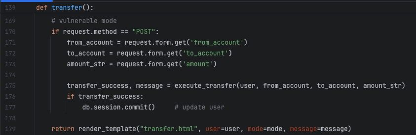

The HTML code only contains a form:

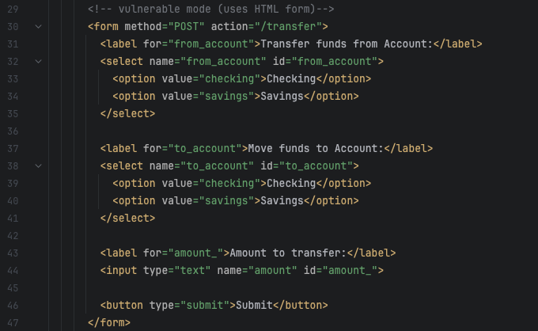

### Setting up App and CSRF Attack servers
Open the terminal.
Navigate to the folder cs467-website-security-research-project/attack-demos/csrf.
Run the CSRF server with the command 'python3 csrf_server.py'
A server should be running at http://localhost:8080/

Open a second terminal.
Navigate to the folder cs467-website-security-research-project.
Run the target server with the command 'python3 app.py'
A server should be running at http://127.0.0.1:5000
Go to http://127.0.0.1:5000/login 

### Performing a CSRF-Attack on the vulnerable app:
Log in to the app with vulnerable mode **On**, username '**tester**', and password '**abc123**'.
Make sure you're logged in. This step is fundamental to demonstrate the attack.
Click on 'Account' and note down the amount in both checking and savings accounts:

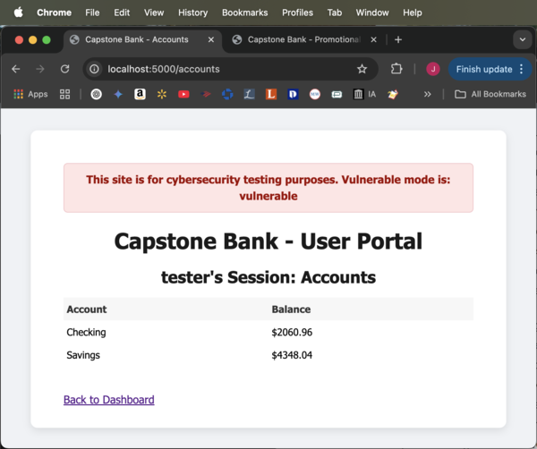

Open a third terminal.
Navigate to the folder cs467-website-security-research-project/attack-demos/csrf.
Run the command 'cat bait_email.md'. This will display the contents of a typical bait email.
Click the hyperlink to execute the attack.

The hyperlink directs the browser to promotion.html in the CSRF server, 
where the **script** executes and sends the hidden form with the malicious code to the app:

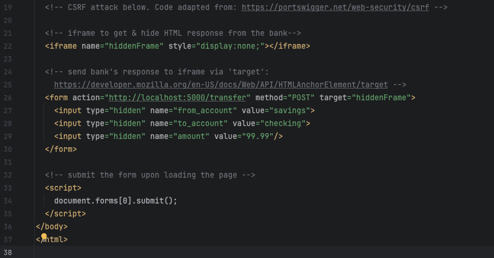

Make sure the webpage displays in the same browser the app is opened on:

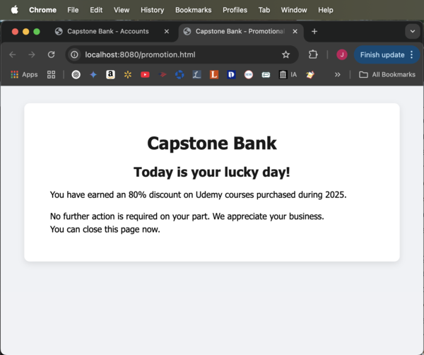

Notice the POST request with **200** code in the app's console signaling a successful transfer:

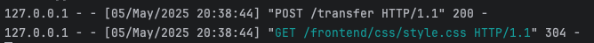

Go back to the app tab and refresh or click on 'Back to Dashboard' and then click on 'Accounts'.
The checking account should have increased $99.99, 
while the savings should have decreased by the same amount:

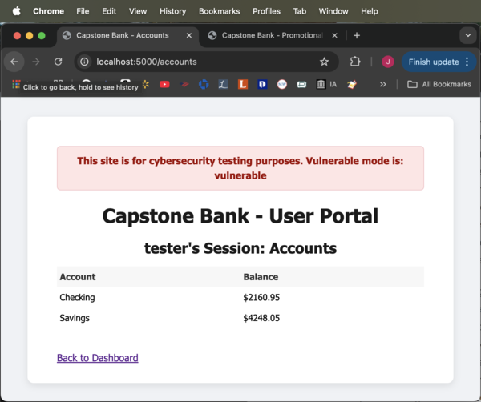

The CSRF Attack successfully executed a malicious transfer between the accounts.

### Securing the app
In **app.py**, I added the imports for the **built-in** module **CSRFProtect**, 
the recommended mitigation according to
https://cheatsheetseries.owasp.org/cheatsheets/Cross-Site_Request_Forgery_Prevention_Cheat_Sheet.html:

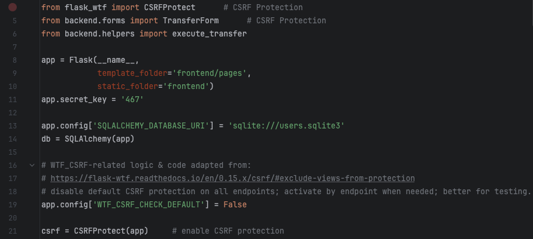

In the python code, I activated the CSRF protection for the transfer endpoint (line 151), 
and used the TransferForm class (line 152), derived from FlaskForm 
instead of the previous raw HTML form:

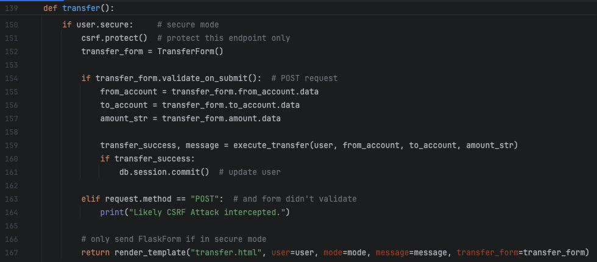

File forms.py containing the TransferForm class created from imported module **FlaskForm**:

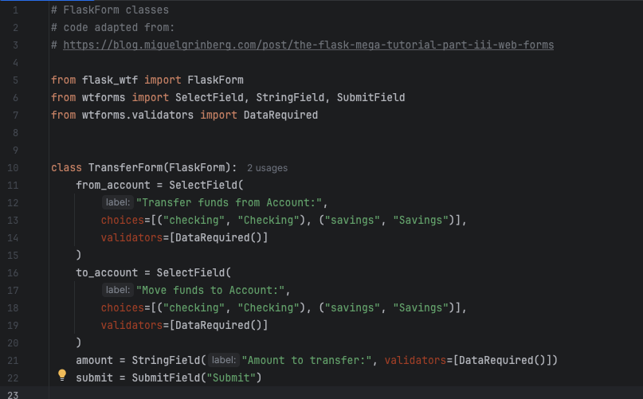

HTML code using FlaskForm:

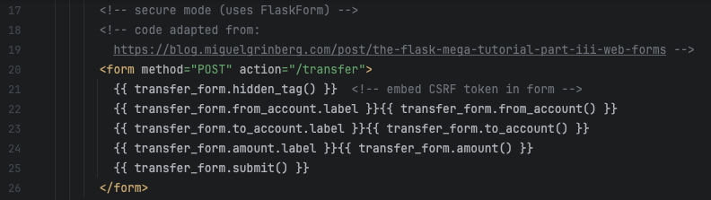

### Performing a CSRF-Attack on the secure app:
Log in to the app with vulnerable mode **Off**, username '**tester**', and password '**abc123**'.
Make sure you're logged in. This step is fundamental to demonstrate the attack.
Click on 'Account' and note down the amount in both checking and savings accounts:

Open a third terminal.
Navigate to the folder cs467-website-security-research-project/attack-demos/csrf.
Run the command 'cat bait_email.md'. This will display the contents of a typical bait email.
Click the hyperlink to execute the attack.
Make sure the webpage displays in the same browser the app is opened on:

Notice the POST request with **400** code in the app's console signaling a failed transfer:

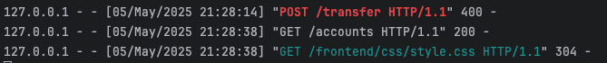

Go back to the app tab and refresh or click on 'Back to Dashboard' and then click on 'Accounts'.
The checking and savings accounts should have the same amount as before:

The CSRF Attack executed but this time the app was able to prevent it.

## Resources:

1. https://www.professormesser.com/security-plus/sy0-601/sy0-601-video/request-forgeries/
2. https://learn.snyk.io/lesson/csrf-attack/?ecosystem=javascript
3. https://portswigger.net/web-security/csrf
4. https://developer.mozilla.org/en-US/docs/Web/API/HTMLAnchorElement/target
5. https://stackoverflow.com/a/5733858 (iframe)
6. https://www.youtube.com/watch?v=aRGdDy18qfY (iframe)
7. https://www.w3schools.com/Html/html_iframe.asp (iframe)
8. https://claude.ai/share/121e97a8-60e6-4a5b-b292-aa612144e379 (code for local server)
9. https://cheatsheetseries.owasp.org/cheatsheets/Cross-Site_Request_Forgery_Prevention_Cheat_Sheet.html (csrf protection)
10. https://flask-wtf.readthedocs.io/en/0.15.x/csrf/#exclude-views-from-protection
11. https://blog.miguelgrinberg.com/post/the-flask-mega-tutorial-part-iii-web-forms (FlaskForms)
