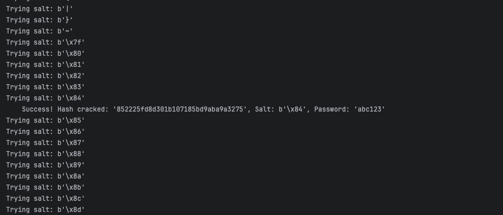

# Password Vulnerabilities: Password Hashing and Password Hash Extraction

## What is stored in the database and used for authentication:
In both vulnerable and secure mode, the app uses passwords for user authentication. 
In a real-life app, only one password (either plaintext or hash) would be stored. 
However, since the app has an educational purpose, it is designed to store **both** plaintexts and hashes. 
When a new user registers, the User object constructor automatically creates the hashes along with the plaintext password: 
```python
# in app.py:
@app.route("/register", methods=["POST", "GET"])
def register():
    if request.method == "POST":
        username = request.form['username']
        password = request.form['password']
        (...)
        new_user = User(role='user', name=username, password=password, email=None)      # <-- HERE: call to object constructor
        db.session.add(new_user)
        db.session.commit()
        (...)
```
```python
# in app.py:
# User model
class User(db.Model):                                                               # <-- HERE: class definition
    _id = db.Column("id", db.Integer, primary_key=True)
    role = db.Column("role", db.String(8))
    name = db.Column("name", db.String(100))
    email = db.Column("email", db.String(320))
    password = db.Column("password", db.String(128))                                # <-- HERE: plaintext password to be used in vulnerable mode
    checking = db.Column("checking", db.Float, default=DEFAULT_CHECKING)
    savings = db.Column("savings", db.Float, default=DEFAULT_SAVINGS)

    # salts & password hashes to store
    md5_salt = db.Column("pwd_salt_md5", db.String(16))
    pwd_hash_md5_unsalted = db.Column("pwd_hash_md5_unsalted", db.String(32))
    pwd_hash_md5_salted = db.Column("pwd_hash_md5_salted", db.String(32))
    pwd_hash_bcrypt = db.Column("pwd_hash_bcrypt", db.String(128))                  # <-- HERE: password hash to be used in secure mode

    def __init__(self, role, name, password, email, checking=DEFAULT_CHECKING, savings=DEFAULT_SAVINGS):    # <-- HERE: object constructor
        self.role = role
        self.name = name
        self.email = email
        self.password = password                                                    # <-- HERE: plaintext password
        self.checking = checking
        self.savings = savings

        # create salt and password hash attributes and store them in database
        # code adapted from: https://geekpython.medium.com/easy-password-hashing-using-bcrypt-in-python-3a706a26e4bf
        password_to_bytes = password.encode('utf-8')  # convert password to array of bytes

        self.pwd_hash_md5_unsalted = hashlib.md5(password_to_bytes).hexdigest()                 # <-- HERE: MD5 (unsalted) password hash

        self.md5_salt = os.urandom(1)   # generate & store 1-byte salt to add to plaintext before hashing
        self.pwd_hash_md5_salted = hashlib.md5(self.md5_salt + password_to_bytes).hexdigest()   # <-- HERE: MD5 (salted) password hash

        # bcrypt password hash will be used in the secure version of the app
        bcrypt_salt = bcrypt.gensalt()  # generate salt to add to plaintext before hashing; stored within hash
        self.pwd_hash_bcrypt = bcrypt.hashpw(password_to_bytes, bcrypt_salt).decode()           # <-- HERE: bcrypt password hash
    (...)
```
(Also note that two more hashes are produced above with a different algorithm (MD5) and stored in the database. 
These will be used later to demonstrate password hash extraction.) 

Once passwords and hashes are stored, the authentication process depends on the app's security mode. 

### Logging in to the App
Because both plaintext passwords and password hashes are stored (for educational purposes), 
the key difference lies in what the app **checks** against in the database during login, 
depending on whether it's running in vulnerable or secure mode. 

In vulnerable mode, the app stores **plaintext** passwords (a major security risk), 
which are then compared to the password entered by the user who is logging in. 
In case of a database leak, the plaintext password will be ready for malicious use. 

In secure mode, the app stores password **hashes** produced by the bcrypt algorithm (best-practice). 
At login, the stored hash is checked against the input password using bcrypt.checkpw(), 
a built-in function which takes in a plaintext password and a hash, and returns a boolean with the result of the match. 
In case of a database leak, the attacker will have to crack the hashes, 
which will be computationally-intensive and time-consuming. 

Here is the code:
```python
# in app.py:
@app.route("/login", methods=["POST", "GET"])
def login():
    if request.method == "POST":
        username = request.form['username']
        password = request.form['password']
        secure_mode = request.form.get('secure') == 'true'
        (...)
        else:
            # Vulnerable version                        # <-- HERE: vulnerable mode: plaintext password is used for authentication
            query = text(f"SELECT * FROM user WHERE name = '{username}' AND password = '{password}'")
            (...)
            
        if user:
            if secure_mode:                             # <-- HERE: secure mode: password hash is used for authentication
                (...)
                password_bytes = password.encode('utf-8')   # change entered password to bytes
                pwd_hash_bcrypt_in_db = user.pwd_hash_bcrypt.encode()     # get bcrypt password hash from db
                password_check = bcrypt.checkpw(password_bytes, pwd_hash_bcrypt_in_db)  # check match
                (...)
```

## Password Hash Extraction
To demonstrate password hash extraction attacks, in addition to hashes created with the **bcrypt** algorithm, 
the app also stores hashes created by the **MD5** algorithm, both unsalted and salted.
Since MD5 and SHA-1 have similar external capabilities, there was no point in demonstrating hash extraction for both. 
Thus, MD5 was selected over SHA-1 because of its speed. 
Notably, MD5’s speed, while efficient, 
is a liability in security contexts because it makes brute-force attacks more feasible.

An important side note is that both MD5 and SHA-1 are **no longer recommended** for password-related authentication.
The advent of multiple technological innovations have rendered both insecure.
Therefore, MD5-hash extraction is shown here for demonstration purposes only. 

MD5 can be used with or without a salt, though salting is strongly recommended. 

The demonstration that follows starts from the hypothetical but common everyday event 
in which a database information is leaked. 
The app already has built-in functionality that simulates this in vulnerable mode: 

[Sensitive Data Exposure](sensitive_data_exposure.md). 
We are building on this vulnerability to access the hashes to attack. 

The following code allows accessing the different hashes stored in the database by making a GET request 
which passes a query parameter that selects the desired hashing algorithm: 
```python
# in app.py:
# generate json with list of users and user data
@app.route("/users.js")
def generate_user_list():
    (...)
    else:                                                                               # <-- HERE: vulnerable mode
        # exposed password depends on query parameter 'pwd_choice'
        pwd_choice = request.args.get('pwd_choice')                                     # <-- HERE: query parameter with algorithm choice
        valid_pwd_choices = {'pwd_hash_md5_unsalted', 'pwd_hash_md5_salted', 'pwd_hash_bcrypt'}
        pwd_attr = pwd_choice if pwd_choice in valid_pwd_choices else 'password'    # default to plaintext pwd
        user_data = [
            {
                (...)
                "password": getattr(user, pwd_attr),
                "checking": user.checking,
                "savings": user.savings
            }
            for user in users
        ]

    json_user_data = f"const exposedUserData = {json.dumps(user_data)};\n"

    return json_user_data, 200, {"Content-Type": "application/javascript"}
```
This is how it works from the terminal using curl commands: 

 

It is worth noting that this feature always triggers the vulnerable mode in the route that leaks the data.

### Common steps to demonstrating password hash extraction:
1. Go to the directory 'attack-demos/password_hash_extraction/'. 
2. Start the app from the root directory by typing the command 'python3 app.py'. There's no need to log in. 
3. From the root directory of the app, go to the directory 'attack-demos/password_hash_extraction/'. 
4. Make sure that the file 'rockyou_1st1k.txt' exists in this directory. 
This file contains the first 1,000 lines of 'rockyou.txt' and is provided as a lightweight sample 
for demonstrating rainbow table creation and brute-force attacks. 
5. Run the file 'pwd_hash_extract.py' by entering the command 'python3 pwd_hash_extract.py'. 

### Cracking an MD5 hash which was generated without a salt using a Rainbow Table
6. Select option 1: MD5 (unsalted) with rainbow table attack

The program will look for the file 'attack-demos/password_hash_extraction/rainbow_table.json', 
which contains a **pre-computed** dictionary whose keys are hashes that map to passwords taken from 'rockyou_1st1k.txt'. 
Each hash was generated from the password it maps to using the MD5 algorithm. 
No salt was added to the password to compute the hash.

If the rainbow file does not exist, it will be created automatically. 
Then, the program will read the contents of the file into a dictionary. 
Last, the code will just do a lookup of each of the exposed hashes and report the results. 

This is the output if the rainbow table file **couldn't** be found: 

 

And the output if the rainbow table **was** found: 

 

Since the time complexity of dictionary lookups is O(1), if an exposed hash matches a dictionary key, 
the plaintext password is found in a matter of milliseconds. 

### Cracking an MD5 hash which was generated with a salt using a Brute-force attack
6. Select option 2: MD5 (salted) with brute-force attack 

A salt is nothing but a random string added to a plaintext password before hashing. 
Its purpose is to make each hash unique, even if users have the same password. 
By incorporating a salt, the difficulty of cracking hashed passwords increases significantly, 
as it prevents the use of pre-computed tables (like the rainbow table used in the previous example) 
and exponentially expands the number of combinations an attacker must test. 

The program will start by generating a salt from each of the 2^8 = 256 possible combinations of 1-byte. 
Each of these salts will be combined with a rockyou password, and from both of them, 
the MD5 algorithm will generate a hash. 
This hash will then be compared against the leaked hashes to check for matches. 

This is the output of the brute-force attack on the salted MD5 hashes: 


    (...)


    (...)


Going forward, all time estimates given are based on rolling averages and worst-case scenarios 
(all combinations are exhausted). 

As said before, 
one of the benefits of salting is that users with the same plaintext password end up with different hashes, as shown above. 
Although two users had the same password ('abc123'), three hashes had to be cracked. 

It is worth noting that even though the program took a fraction of a second to process all combinations, 
the 1-byte salt used in the demonstration pales in comparison with the standard 8-16 bytes salts recommended. 
Just for the sake of contrast, a 16-byte salt would require 2^128 combinations, making brute-force attacks impossible. 
On top of that, the example above used only 1,000 passwords to combine with, which is rather trivial: 
only 256,000 combinations are tried in a worst-case scenario.

If a 2-byte salt were to be used with the full rockyou.txt file, the time increases dramatically to around 178 hours: 


Interestingly, even with this gigantic increase of combinations, 
the code is still able to crack a hash within the first minutes of the attack. 

### Cracking a bcrypt hash using a Brute-force attack
6. Select option 3: bcrypt with brute-force attack 

This option (bcrypt) works just as the previous one (MD5), but there are a couple of caveats: 
First, the speed of MD5 is actually a vulnerability when in comes to fighting brute-force attacks. 
bcrypt overcomes this by using iterations, which in return substantially slow the hashing process. 
Second, bcrypt **has** to be used with a salt, and it also provides a built-in function that generates the salt:
```python
# in app.py:
    (...)
    class User(db.Model):
        (...)
        # bcrypt password hash will be used in the secure version of the app
        bcrypt_salt = bcrypt.gensalt()  # generate salt to add to plaintext before hashing; stored within hash      <-- HERE
        self.pwd_hash_bcrypt = bcrypt.hashpw(password_to_bytes, bcrypt_salt).decode()                               <-- HERE
```
Since a bcrypt hash contains the number of iterations as well as the salt used to hash the plaintext password with, 
the strategy for the brute-force attack was rather simple: 
The program iterates over each leaked hash and compares it against potential passwords in 'rockyou.txt' using bcrypt.checkpw():
```python
# in pwd_hash_extract.py:
(...)
else:
    (...)
        (...)
            if bcrypt.checkpw(pwd, exposed_hash):   # check match                                   <-- HERE
                salt = exposed_hash[:29]    # salt is first 29 characters in hash
                print(f"\tSuccess! Hash cracked: {exposed_hash}, Salt: {salt}, Password: '{pwd.decode('utf-8')}'")
                exposed_hashes_cracked -= 1
                break
```
This is the output of the code for this option using 'rockyou_1st1k.txt': 


Again, going over the three exposed hashes takes less than 5 minutes, 
but we have to remember that this is so because of the relatively small size of the batch of passwords to check. 
If we switched to check the 14 million passwords in 'rockyou.txt', the time estimate is significantly higher:  


Which means that it would take approximately 45 days to go through all passwords in 'rockyou.txt'. 
Last, a couple of questions: Did bcrypt make it harder to crack the leaked hashes? An astound yes. 
Are bcrypt hashes impossible to crack? No. 
As shown in the screenshot, the leaked hashes whose original password was 'abc123' were cracked. 

**This last fact takes us to the key takeaways from this exercise**: 
1) Weak passwords are a real liability: 
even a bcrypt hash can be cracked using a brute-force attack if a weak password was used. 
2) Hashes are the best option when it comes to storing authentication-related data. 
3) Using salt with the plaintext password is of utmost importance. 
4) As computational power increases, so does the capacity of malicious actors of cracking hashes. 
Therefore, as new algorithms and attack techniques emerge, 
staying updated and adopting modern password hashing standards is essential. 

## Resources:

1. https://stytch.com/blog/what-is-password-hashing/
2. https://blog.logto.io/password-hashing
3. https://www.geeksforgeeks.org/hashing-passwords-in-python-with-bcrypt/
4. https://www.geeksforgeeks.org/md5-hash-python/
5. https://dev.to/shittu_olumide_/python-hashing-and-salting-4dea
6. https://geekpython.medium.com/easy-password-hashing-using-bcrypt-in-python-3a706a26e4bf (bcrypt)
7. https://auth0.com/blog/hashing-in-action-understanding-bcrypt/
8. https://stackoverflow.com/questions/6832445/how-can-bcrypt-have-built-in-salts
9. https://github.com/brannondorsey/naive-hashcat/releases/download/data/rockyou.txt
10. https://stackoverflow.com/questions/37633927/unicodeencodeerror-when-reading-a-file (errors=“ignore”)
11. https://chatgpt.com/share/68326fb2-97e4-800c-8b80-b59f9dd746d8 (using open())
